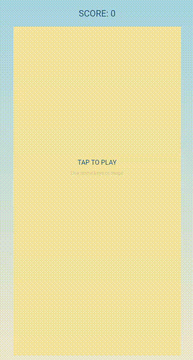

# flamebreakout

Woz's Breakout redo in Flame, Flutter.

> [Base from Codelab](https://codelabs.developers.google.com/codelabs/flutter-flame-brick-breaker)

---

## Flutter

A few resources to get you started if this is your first Flutter project:

- [Lab: Write your first Flutter app](https://docs.flutter.dev/get-started/codelab)
- [Cookbook: Useful Flutter samples](https://docs.flutter.dev/cookbook)

---
